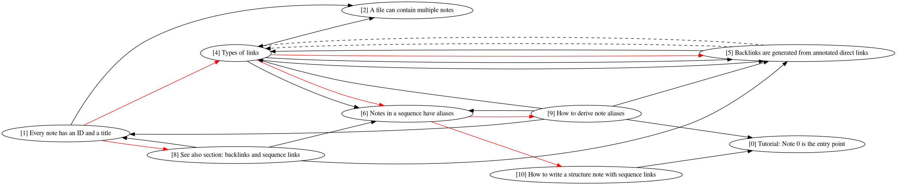

# 0 Tutorial: Note 0 is the entry point

`slipbox` assumes that note 0 is the first page.
You can use it as an entry point to your notes.

- You can organize your notes in files in many ways [](#2 '0b').
- Just remember to put the note ID and the title in a level 1 header. [](#1 '0a').
- You can make connections between notes using tags [](#3 '0c').
- But it's better if you make more specific types of connections [](#4 '0a1').
- `slipbox` supports direct links, backlinks [](#5 '0a1a') and sequence links [](#6 '0a1b').
    + To create note sequences, you need to understand note aliases [](#9 '0a1b1')
    + and the syntax [](#10 '0a1b2').
- Another way to look for notes is by using text search [](#13 '0f').
- Backlinks and sequence links appear in the 'See also' section of each note [](#8 '0a2').
- You can add citations by specifying a bibliography file [](#7 '0d').
- You can visualize notes using `slipbox.graph` [](#11 '0e').
    + How to link to images? [](#12 '0e1').

{ width=100% }

# 1 Every note has an ID and a title

Each note must have a unique ID and a title.
The ID has to be an integer.
To add a new note just create a level 1 header containing an ID followed
by a space and a title.

```markdown
# 1 Every note has an ID and a title

This belongs to note 1.

# 2 This is a different note
```

# 2 A file can contain multiple notes

You can place any number of notes in a file, but notes can't be split
into multiple files.
In this case, a note contains everything until the [header][2-1] of the
next note.

[2-1]: #1 "Notes in a single file are separated by headers."

# 3 You can use hashtags anywhere in the note

#You #can #add #tags #like #this.

Click on the tags to see a list of notes with the same tag.

# 4 Types of links
#links #backlinks #sequence-links

`slipbox` supports several types of links.

Direct links
:   You can link to other notes by specifying the note ID as the target.
    This works even when the note section is in [another file](#2).
    Even if you move the linked note to another file, the link will
    still be valid.

[Backlinks](#5 "An annotated direct link generates a backlink.")
:   An annotated direct link generates a backlink.
    It's sometimes nicer to put the annotation in a reference link.
    But you have to make sure that the label is unique across all your
    note files.
    One way to do this is to use IDs of the source and target notes,
    like this [\[4-5\]][4-5].

Sequence links
:   A [sequence link](#6) is a special type of link that indicates the
    order to read a sequence of notes in.

[4-5]: #5 "This creates another backlink."

# 5 Backlinks are generated from annotated direct links
#links #backlinks

This note has backlinks generated from note 4 in the 'See also' section
[][5-8].
If you hover over the backlink, you'll see the description from the
[forward link](#4).

[5-8]: #8 "The See also section contains generated backlinks."

# 6 Notes in a sequence have aliases
#sequence-links #aliases

While [note IDs][6-1] are meant to uniquely identify notes,
aliases are meant to show which notes belong in a sequence.
For example,
```
0a -> 0a1 -> 0a1b
```

Just by looking at the aliases of a note, you'll know which notes come
before and after it.
Each of these aliases correspond to a real ID.
These aliases are defined in an outline note using
[sequence links](#10).

You can see the immediate neighbors of this note in the 'See also'
section [][6-8].

[6-1]: #1 "Notes can have alias IDs."
[6-8]: #8
    "The aliases of the sequence neighbors of a note appear in the
    See also section."

# 7 Specify a bibliography file to use citations
#tools

If you specify a bibliography in the options, `slipbox` generates a
bibliography page containing every reference in the bibliography.
You can access this page by replacing the URL hash with
\#[references](#references).

It also generates a section for each cited reference, which contains a
list of all notes that cite the reference [@cite2020].

You have to specify the bibliography file using the `-c` option.
Take note of the quotes and the spaces in the options.

```bash
python -m slipbox notes.db notes -c ' --bibliography notes.bib' -d ' -o notes.html'
```

# 8 See also section: backlinks and sequence links
#backlinks #sequence-links #aliases

The 'See also' section lists [backlinks][8-5] and [sequence links][8-6].
The sequence links include 'previous notes' and 'next notes' as defined
by some outline note.
You can distinguish between backlinks and sequence links by looking at
the ID that appears next to the title of the linked note.

-   Backlinks are shown with [real IDs](#1) (only contain numbers).
-   Sequence links are shown with [aliases](#6) (contain a mix of
    numbers and letters [](#9)).

[8-5]: #5 "Backlinks appear in the See also section."
[8-6]: #6 "Immediate neighbors appear in the See also section."

# 9 How to derive note aliases
#aliases #sequence-links

A note alias is a string of numbers and letters.
It always starts with a number.

Example: [0a1b](#6).
The first number (0) indicates the owner or the outline note of the
sequence.
Often it is the ID of the note that contains the sequence link for the
alias.

In this example, [0a1](#4) is preceded by [0a](#1) and followed by
[0a1b](#6).
Presumably, there's another note [0a1a](#5) that follows note [0a1](#4).
So to follow a note alias, just append a number \[letter\] if the last
symbol is a letter \[number\].
The sequence links for these note aliases are defined in note [](#0).

# 10 How to create a sequence link
#sequence-links #aliases

A sequence link looks just like a [direct link](#4),
but there's one difference: it contains an alias description.

A sequence link has three parts.

1. Some (optional) text
2. The [real ID](#1) of the target note
3. The note [alias][10-6]

```markdown
[Text](#11 '10a1b3')
```

Note 0 contains sequence links for these notes [](#0).

[10-6]: #6 "The note alias is used to annotate a sequence link."

# 11 Visualize notes using `slipbox.graph`
#tools #links #sequence-links #backlinks #visualization

```bash
python -m slipbox notes.db notes -d ' -o notes.html'
python -m slipbox.graph notes.db -d -s -b -o notes.dot
dot notes.dot -Tpng -o notes.png
```

The output would look something like this.

{ width=100% }

Black lines represent [direct links][11-4] and red lines represent
[sequence links][11-10].
Dashed lines represent [backlinks][11-5].

[11-4]: #4 "Direct links can be visualized using slipbox.graph."
[11-5]: #5 "Backlinks can be visualized using slipbox.graph."
[11-10]: #10 "Sequence links can be visualized using slipbox.graph."

# 12 How to link to images
#images #links

You can [link](#4) to images using absolute paths, relative paths and
URLs.
Relative paths are interpreted to be relative to the output HTML.

Suppose you have the following directory structure.

```bash
notes/input.md
output.html
images/image.png
```

You could link to `image.png` from `notes/input.md` as:

```markdown

```

# 13 Text search
#text #search

You can search your notes by going to #[search](#search).
